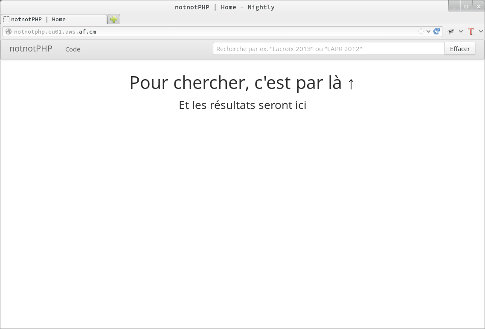
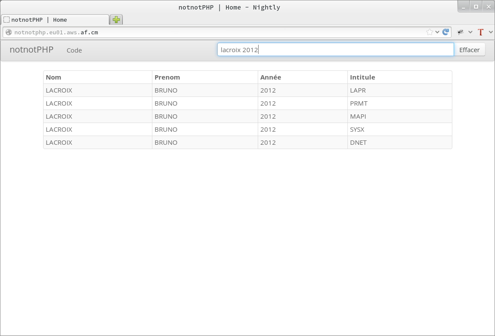

# notnotPHP - Bernard Debecker - 2013

## Introduction

Il nous a été demandé de créer un petit site Web permettant de consulter une base de données. Celle-ci établit la relation entre les professeurs d'une école et les cours qu'ils y dispensent, année par année.

Etant parfait novice dans le langage PHP, j'ai décidé d'allier la simplicité à l'efficacité pour ce projet.
La partie serveur répond à la structure MVC demandée et la partie client est effectuée en JavaScript, langage avec lequel je suis beaucoup plus à l'aise.

## Réalisation du MVC

### Modèle

La classe NotNotDAO est très simple : une fonction assure la connexion à la base de données distante, la seconde, à l'aide de la requète suivante, permet l'extraction de toutes les données qu'elle contient.

	SELECT * FROM prof JOIN enseigner ON prof_id = id_prof JOIN cours ON id_cours = cours_id

### Vue

La vue est structurée en deux parties :

+ La barre de navigation contenant le champ de recherche.
+ Le corps de la page contenant le tableau de représentation des données.

La mise en forme est faite à l'aide de Bootstrap.
La gestion des évènements de la page à l'aide de la librairie JavaScript jQuery et jQuery dataTables.

De base, la vue n'affiche pas le tableau de données. Celui-ci peut-être affiché malgré tout en tapant "*" dans la barre de recherche.

Lorsque l'utilisateur commence à taper dans la barre de recherche, les informations disparaissent au profit du tableau de données. Dans celui-ci, les données sont filtrées en temps réel, à chaque ajout ou retrait de lettre dans la barre de recherche.

La recherche se fait sur tous les champs à la fois. Ainsi, l'utilisateur recherchant les cours de Bruno en 2013 peut simplement taper "Bruno 2013".

Chaque colonne peut-être triée de façon ascendante ou descendante simplement en cliquant sur l'en-tête de chaque colonne.

### Contrôleur

Le contrôleur est à l'image du projet en général : simple.

Une seule fonction lui est attribuée : récupérer les requètes de type GET, récupérer les données via la classe de DAO et afficher la vue.

Le fonctionnement même d'un modèle MVC réduit à sa plus simple expression.

## Mise en production.

Le code est hébergé par [AppFog](https://www.appfog.com/), une "plate-forme en tant que service" ([PaaS](http://fr.wikipedia.org/wiki/Plate-forme_en_tant_que_service)). Le code est simplement uploadé sur les serveurs à l'aide d'un module ruby utilisé en console.

	af login

Permet de se loguer.

	af update notnotphp

Permet d'uploader le code sur les serveurs d'AppFog.

Il ne reste plus qu'à accéder à l'application via [http://notnotphp.eu01.aws.af.cm/](http://notnotphp.eu01.aws.af.cm/)

La base de donnée elle est hébergée par [AlwaysData](https://www.alwaysdata.com/)

## Rapport

Le rapport ainsi que le README du projet sont écrits en [Markdown](http://daringfireball.net/projects/markdown/), un langage de balisage léger.
Le rapport est lui converti en .pdf grâce à [Pandoc](http://johnmacfarlane.net/pandoc/), un convertisseur de fichier texte en console.
	
	pandoc rapport.md -o rapport.pdf

La commande permettant d'exporter le rapport au format Markdown en PDF.